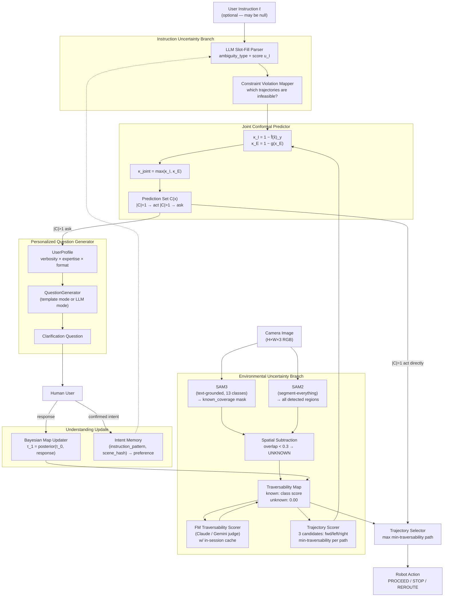

# System Architecture Diagram

## Mermaid Diagram (for slides and digital documents)



---

## ASCII Diagram (for LaTeX paper figure)

```
  User Instruction ℓ              Camera Image (RGB)
        │                                  │
        ▼                                  ▼
 ┌─────────────────┐            ┌──────────────────────┐
 │  INSTRUCTION    │            │  ENVIRONMENTAL       │
 │  BRANCH         │            │  BRANCH              │
 │                 │            │                      │
 │  LLM Slot-Fill  │            │  SAM3 (13 classes)   │
 │  Parser         │            │  + SAM2 (all segs)   │
 │  → ambig type   │            │  → spatial subtract  │
 │  → score u_I    │            │  → UNKNOWN regions   │
 │                 │            │                      │
 │  Constraint     │            │  FM Traversability   │
 │  Violation Map  │            │  Scorer (judge LLM)  │
 │  → κ_I          │            │  → TraversabilityMap │
 └────────┬────────┘            └──────────┬───────────┘
          │                               │
          │  κ_I = 1 − f̂(x̃)_y            │  κ_E = 1 − g(x_E)
          └─────────────┬─────────────────┘
                        ▼
             ┌─────────────────────┐
             │  JOINT CONFORMAL    │
             │  PREDICTOR          │
             │  κ_joint = max(κ_I, │
             │                κ_E) │
             │  C(x) = {y : f̂ ≥   │
             │          1 − q̂}    │
             └──────────┬──────────┘
                        │
           ┌────────────┴────────────┐
           │                         │
      |C|=1 (act)              |C|>1 (ask)
           │                         │
           ▼                         ▼
  Trajectory Selector      Personalized Question
  (max min-traversability)  Generator
           │               (UserProfile:
           │                verbosity × expertise
           │                × format)
           │                         │
           │                    Human User
           │                         │
           │                    ┌────┴────────────────┐
           │                    │  Understanding Update│
           │                    │  Bayesian Map Update │
           │                    │  τ_1 = post(τ_0, r)  │
           │                    │  Intent Memory       │
           │                    └────┬────────────────┘
           │                         │ (updated traversability map)
           └────────────┬────────────┘
                        ▼
               Robot Action Output
               PROCEED / STOP
```

---

## Component Descriptions (for paper caption)

**Instruction Uncertainty Branch.** An LLM (Claude claude-sonnet-4-6) parses
the user's instruction and identifies missing semantic slots (object, direction,
distance, or action verb). The ambiguity score $u_I \in [0,1]$ quantifies
how uncertain the command is. A constraint violation mapper determines which
of three candidate trajectories are infeasible under the ambiguous command.

**Environmental Uncertainty Branch.** SAM3 (text-grounded, 13 terrain classes)
and SAM2 (segment-everything) run in parallel. Spatial subtraction identifies
SAM2 regions with less than 30% overlap with SAM3 coverage as "unknown." A
foundation model traversability scorer assigns class-conditioned traversability
values (cached per session) to build a per-pixel traversability map.

**Joint Conformal Predictor.** The two branch non-conformity scores are
max-pooled into a joint score and calibrated via conformal prediction, providing
a $1-\varepsilon$ coverage guarantee. A prediction set size greater than one
triggers the question generation path.

**Personalized Question Generator.** A `UserProfile` (verbosity × expertise ×
preferred format) shapes the generated clarification question. Both template
and LLM-backed generation modes respect the profile.

**Understanding Update.** After the user responds, a Bayesian posterior update
refines the traversability map, and confirmed intent is stored in memory to
prevent repeated identical questions in future interactions. The robot then
re-selects the best trajectory with updated knowledge and proceeds.

---

## Data Flow for Each Uncertainty Type

### Pure Instruction Uncertainty (no environmental sensor trigger)

```
Instruction ℓ → Parser → u_I → CP (κ_I only, κ_E = 0)
  → |C| > 1 if u_I > θ_ask
  → Question Gen → User → Intent confirmed
  → Trajectory Selector → PROCEED
```

### Pure Environmental Uncertainty (no user instruction)

```
Image → SAM3+SAM2 → UNKNOWN regions → Traversability Map
  → FM Scorer → κ_E → CP (κ_I = 0, κ_E only)
  → |C| > 1 if unknown region intersects trajectory
  → Question Gen → User → Bayesian Map Update
  → Re-score trajectories → PROCEED / STOP
```

### Combined (both uncertainty types active)

```
Instruction ℓ + Image → both branches run in parallel
  → κ_joint = max(κ_I, κ_E)
  → if either branch uncertain: ask
  → resolve both via Q&A loop
  → update traversability map AND intent memory
  → PROCEED
```
